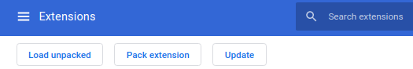

# you2share

Chrome extension for sharing youtube videos with friends. 

## How to use the extension?
1. Download the Project 
2. Go to Extension settings in chrome [URL](chrome://extensions/)
3. Activiate Developer mode in chrome 
    
   
    
   *on top right corner* 
4.  Now you will get a new section right below the search bar
    
   
    
   *Click on Load unpacked button and locate the UI folder*

## What can you contribute? 
- UI side
  1. Make the popup.html better
  2. Make Modal in content.js page better 
  3. Make the project more structured, keeping HTML and CSS separately.
  4. Add better Icons 
   
- API side
  1. Complete the code for registration email during signup 
  2. Submit Ideas of what more backend changes can be done
   
- Project 
  1. Make Homepage for the whole project, like converting this README into an HTML page and attaching it to Github pages
  2. Add a Release for direct download of the extension folder